<p align="center">
  
</p>

<br/>

<!-- TERMINAL SECTION -->

<p align="center">
<a href="https://github.com/riadmmdli">

</a>
</p>

<p align="center">
<a href="https://github.com/riadmmdli">

</a>
</p>

<br/>

<!-- ABOUT ME -->

<h2 align="center">
  
</h2>

<table align="center">
<tr>
<td>

```
+--------------------------------------------------------------+
|                                                              |
|  > Software Engineering Student @ Erciyes University         |
|  > Location: Kayseri, Turkey                                 |
|  > Focus: AI . Computer Vision . Mobile Development         |
|                                                              |
|  > Interests: Deep Learning . NLP . Android . CV            |
|  > Languages: Python . Java . MATLAB . C#                   |
|                                                              |
+--------------------------------------------------------------+
```

</td>
</tr>
</table>

<br/>

<!-- TECH STACK -->

<h2 align="center">
  
</h2>

<h4 align="center">── AI · MACHINE LEARNING ──</h4>

<p align="center">
  
  
  
  
  
  
</p>

<h4 align="center">── MOBILE DEVELOPMENT ──</h4>

<p align="center">
  
  
  
  
</p>

<h4 align="center">── LANGUAGES · TOOLS ──</h4>

<p align="center">
  
  
  
  
  
</p>

<h4 align="center">── NLP · SPEECH ──</h4>

<p align="center">
  
  
  
</p>

<br/>

<!-- FEATURED PROJECTS -->

<h2 align="center">
  
</h2>

<table>
<tr>
<td width="50%" valign="top">

### [`Sentiment-Analysis-with-TTS`](https://github.com/riadmmdli/Sentiment-Analysis-with-TTS)

> Turkish Emotional Text-to-Speech system. Fine-tuned BERT model detects emotion in text and synthesizes matching voice via ElevenLabs API.


</td>
<td width="50%" valign="top">

### [`REAL-TIME-HAND-GESTURE-RECOGNITION`](https://github.com/riadmmdli/REAL-TIME-HAND-GESTURE-RECOGNITION)

> Real-time webcam hand gesture recognition using custom CNN and MobileNetV2. TensorFlow/Keras + OpenCV pipeline.


</td>
</tr>

<tr>
<td width="50%" valign="top">

### [`YOLOv2-Medical-SAM-Brain-Tumor`](https://github.com/riadmmdli/YOLOv2-Medical-SAM-Brain-Tumor)

> Medical imaging system combining YOLOv2 with SAM (Segment Anything Model) for brain tumor detection and segmentation. MATLAB App Designer GUI.


</td>
<td width="50%" valign="top">

### [`SafeDrive-Mobile-App`](https://github.com/riadmmdli/SafeDrive-Mobile-App)

> Android safety app analyzing traffic accident data in Kayseri to warn drivers of high-risk zones. Firebase + Google Gemini LLM integrated.


</td>
</tr>

<tr>
<td width="50%" valign="top">

### [`Emotion-Dubbing`](https://github.com/riadmmdli/Emotion-Dubbing)

> NLP + TTS pipeline converting text into emotionally expressive speech using BERT emotion detection and ElevenLabs voice synthesis.


</td>
<td width="50%" valign="top">

### [`Ball-Bounce-Arcade-Game`](https://github.com/riadmmdli/Ball-Bounce-Arcade-Game)

> Physics-based Android arcade game — control a paddle to keep a bouncing ball in play. High score tracking, increasing speed, custom UI.


</td>
</tr>
</table>

<br/>

<!-- GITHUB STATS -->

<h2 align="center">
  
</h2>

<p align="center">
  
  
</p>

<p align="center">
  
</p>

<br/>

<!-- CONTRIBUTION SNAKE -->

<h2 align="center">
  
</h2>

<p align="center">
  <picture>
    <source media="(prefers-color-scheme: dark)" srcset="https://raw.githubusercontent.com/riadmmdli/riadmmdli/output/github-contribution-grid-snake-dark.svg"/>
    <source media="(prefers-color-scheme: light)" srcset="https://raw.githubusercontent.com/riadmmdli/riadmmdli/output/github-contribution-grid-snake.svg"/>
    
  </picture>
</p>

<br/>

<!-- CURRENT FOCUS -->

<h2 align="center">
  
</h2>

<p align="center">
<a href="https://github.com/riadmmdli">

</a>
</p>

<br/>

<!-- CONNECT -->

<h2 align="center">
  
</h2>

<p align="center">
  <a href="https://github.com/riadmmdli">
    
  </a>
  &nbsp;
  <a href="https://www.linkedin.com/in/riad-mammadli-62985324b/">
    
  </a>
</p>

<br/>

<!-- FOOTER -->

<p align="center">
  <a href="https://github.com/riadmmdli">
    
  </a>
</p>

<details>
<summary><sub>◈</sub></summary>
<p align="center">
  
</p>
</details>
